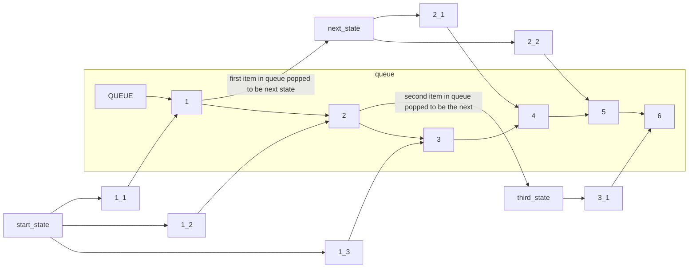
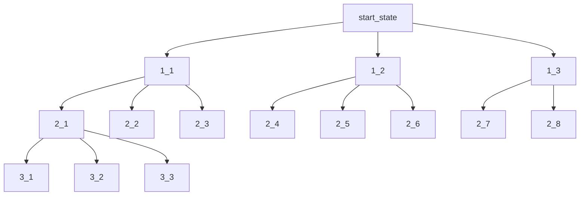
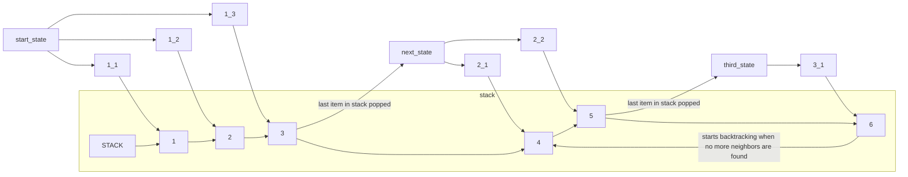
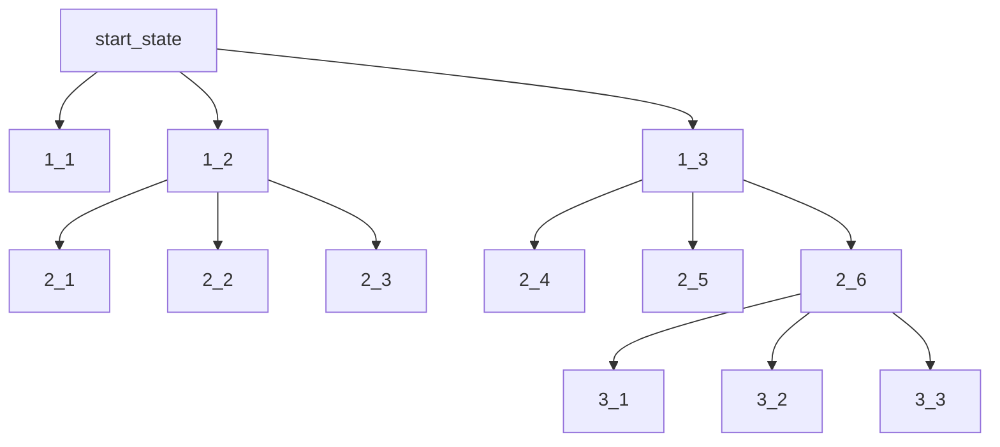

# Search algorithms

Implementations of search algorithms taught during the course.

## Breadth- and depht-first searches

### Breadth-first search

[BFS](./bfs.py)

#### Hopefully senseful graphs

Queue catches up with it's building (it's depth) once no more neighbors are found

### Depth-first search

[DFS](./dfs.py)

#### Hopefully senseful graphs

Stack starts backtracking and building it's breadth once no new neighbors for state are found

